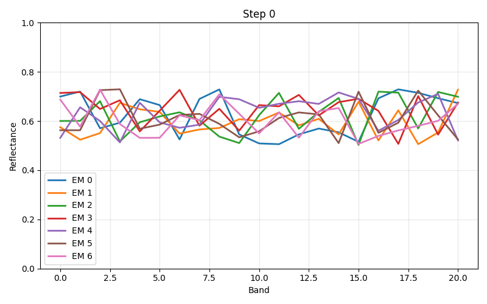
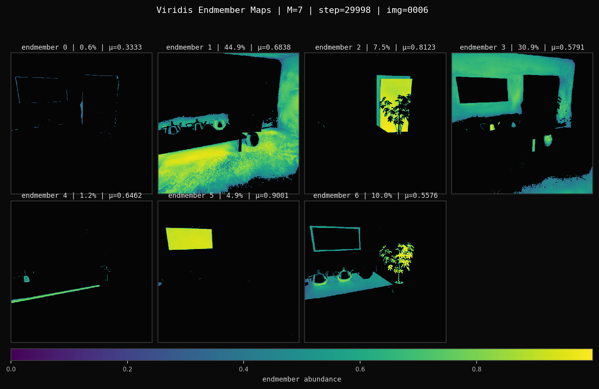

# Hyperspectral 3D Gaussian Splatting with Spectral Unmixing and Segmentation

<!-- BADGES -->
[](https://www.python.org/)
[](https://pytorch.org/)
[](LICENSE)

---

## Abstract
This Bachelor's Thesis presents an ongoing research project on Hyperspectral 3D Gaussian Splatting (HS-3DGS), a framework that combines neural scene representation with hyperspectral spectral unmixing for physically interpretable 3D scene reconstruction. The central idea is to extend 3D Gaussian Splatting beyond conventional RGB rendering by enabling each Gaussian to model the full spectral response of a scene across multiple wavelengths while simultaneously recovering the underlying material composition.

Beyond rendering, the framework integrates a **Extended Linear Mixing Model (ELMM)** for hyperspectral unmixing: each rendered spectral pixel is decomposed into a set of pure material spectra (**endmembers**) and their corresponding spatial distributions (**abundances**). The ELMM extends the classical Linear Mixing Model by allowing band-dependent scaling factors — via a Hadamard-product variability tensor — to account for illumination gradients, atmospheric distortions, and wavelength-specific reflectance shifts that a single multiplicative scalar cannot capture.

Segmentation of the 3D scene is achieved by coupling the Gaussian opacity and spectral fields with a learned material classifier. Since endmember abundances provide a per-pixel material decomposition, they serve directly as soft segmentation maps; hard segmentation masks are obtained by an argmax over the abundance volume, enabling material-level scene parsing without additional annotation.

The system is evaluated on the **NeSpoF** synthetic dataset (21 spectral bands) and produces rendered spectral images, per-material abundance maps, estimated endmember spectra, and segmentation masks as standard `.png` outputs, with all intermediate spectral volumes stored as `.npy` arrays for downstream analysis.

---

## Table of Contents

- [Framework Overview](#framework-overview)
- [Installation](#installation)
- [Dataset — NeSpoF Synthetic Scenes](#dataset--nespof-synthetic-scenes)
- [Data Format (.npy)](#data-format-npy)
- [Running the Pipeline](#running-the-pipeline)
  - [Rendering Modes](#rendering-modes)
- [Results](#results)
  - [Novel View Synthesis](#novel-view-synthesis)
  - [Abundances](#abundances)
  - [Endmembers](#endmembers)
  - [Segmentation](#segmentation)
- [Citation](#citation)

---

## Framework Overview

<!-- ADD YOUR PIPELINE FIGURE HERE -->
<!-- Example:  -->

```
[ pipeline figure ]
```

---

## Installation

```bash
# Clone the repository
git clone https://github.com/your-username/hs-3dgs.git
cd hs-3dgs

# Create environment
conda create -n hs3dgs python=3.9 -y
conda activate hs3dgs

# Install dependencies
pip install torch torchvision --index-url https://download.pytorch.org/whl/cu118
pip install -r requirements.txt

# Build CUDA extensions (tile rasterizer, SH ops)
pip install submodules/diff-gaussian-rasterization
pip install submodules/simple-knn
```

---

## Dataset — NeSpoF Synthetic Scenes

This project uses the **NeSpoF** (Neural Spectral Point Features) synthetic dataset for evaluation on controlled hyperspectral scenes.

> **Download:** [NeSpoF Synthetic Scenes — Google Drive](https://drive.google.com/drive/folders/1W7apuXPA3EkyUs8VgZgwdMpnc96aLXXJ)

The NeSpoF dataset provides synthetic hyperspectral scenes rendered with **21 spectral bands**, spanning the visible and near-infrared regions. Each scene includes:

- Multi-view hyperspectral images with known camera poses (COLMAP-compatible)
- Ground-truth spectral cubes per view
- Reference endmember spectra for unmixing evaluation
- Ground-truth abundance and segmentation maps for quantitative assessment

**Recommended directory structure after download:**

```
data/
└── nespof/
    ├── ajar/
    │   ├── ajar_npy/             # .npy hyperspectral frames  [H × W × 21]
            ├── train/
            ├── val/             
    │   ├── ajar_colmap/          # COLMAP sparse reconstruction
            ├── sparse/ 
    ├── hotdog/
    └── ...
```


```python
import numpy as np

# Load a hyperspectral frame (H × W × 21 for NeSpoF)
hsi = np.load("data/nespof/ajar/ajar_npy/train/r_1.npy")   # float32, [0,1]

```

---

**Training**

Example training command:

```python
python examples/simple_trainer_HSI.py default \
    --hyperspectral_data_dir data/nespof/ajar/ajar_npy \
    --colmap_dir data/nespof/ajar/colmap/sparse/0 \
    --result_dir outputs/ajar \
    --rendering_mode spectral_sh \
    --unmixing_model elmm_sh \
    --num_endmembers 5 \
    --sh_hyperspectral \
    --max_steps 40000
```


**Outputs**

After training, the framework produces:

1. Novel-View Hyperspectral Rendering

Rendered spectral images for all wavelengths.

2. Estimated Endmember Spectra

Recovered material signatures learned through ELMM.

<h3 align="center">Estimated Endmember Spectra</h3>

<p align="center">
  
</p>

<p align="center">
  <em>Recovered material signatures learned through ELMM.</em>
</p>


3. Abundance Maps

For each material, the model estimates a spatial abundance map describing the contribution of that material at every pixel.

<p align="center">
  
</p>


## Hyperspectral Unmixing with ELMM

The proposed framework integrates the **Extended Linear Mixing Model (ELMM)** into the 3D Gaussian Splatting pipeline to recover physically interpretable material information from hyperspectral observations.

Unlike the classical Linear Mixing Model (LMM), which assumes that each material is represented by a fixed spectral signature, ELMM introduces spectral variability by allowing each endmember spectrum to adapt across wavelengths. This is particularly important in multi-view hyperspectral reconstruction, where the observed spectrum of a material may change due to:

* Illumination variations.
* Viewing-angle (angular) effects.
* Surface reflectance anisotropy.
* Sensor noise and acquisition conditions.
* Spectral distortions between viewpoints.

For each rendered hyperspectral pixel, the spectral signal is modeled as

```text
x = Σ(k=1→K) a_k · (m_k ⊙ s_k)
```

where:

* **x ∈ ℝᴮ** is the observed hyperspectral spectrum.
* **aₖ** denotes the abundance of material *k*.
* **sₖ** is the reference endmember spectrum.
* **mₖ** is a wavelength-dependent variability factor.
* **⊙** denotes the Hadamard (element-wise) product.
* **K** is the number of endmembers.
* **B** is the number of spectral bands.

The variability term  **mₖ** enables each material signature to adapt to local spectral changes, effectively modeling angular variability and other spectral perturbations encountered across different viewpoints. From a rendering perspective, this can be interpreted as a physically-motivated spectral noise model that accounts for changes in material appearance while preserving the underlying material identity.

As a result, the framework jointly learns:

1. A 3D Gaussian representation of the scene.
2. Hyperspectral radiance across all wavelengths.
3. Material endmember spectra.
4. Per-pixel abundance maps.
5. Material-aware segmentation masks.

The estimated abundance maps provide a soft material decomposition of the scene, while hard segmentation masks are obtained by assigning each pixel to the material with the highest abundance value.


```text
Hyperspectral Images
          │
          ▼
    3D Gaussian Splatting
          │
          ▼
  Hyperspectral Rendering
          │
          ▼
        ELMM
          │
    ┌─────┴─────┐
    ▼           ▼
Endmembers  Abundances
                 │
                 ▼
          Segmentation
```

By combining ELMM with Hyperspectral 3D Gaussian Splatting, the framework not only reconstructs novel hyperspectral views but also provides a material-level understanding of the scene that remains robust to spectral variability across multiple viewpoints.

---

## Running the Pipeline

### Rendering Modes

The `rasterization()` function in `rendering.py` supports four rendering modes controlled by the `rendering_mode` argument:

- `"rgb"`Standard 3-channel RGB rendering, no SH
- `"rgb_sh"` RGB rendering with Spherical Harmonics (`sh_degree` ≥ 0) |
- `"spectral"`  Full-spectrum rendering (N bands), post-activation colors |
- `"spectral_sh"` Full-spectrum rendering with wavelength-aware SH (`sh_degree` ≥ 0) |

**Quick-start — spectral rendering with SH on NeSpoF:**

```python
from rendering import rasterization
import torch

render_colors, render_alphas, meta = rasterization(
    means=means,            # [N, 3]
    quats=quats,            # [N, 4]
    scales=scales,          # [N, 3]
    opacities=opacities,    # [N]
    colors=colors,          # [N, K, M]  — SH coefficients, K=(sh_degree+1)^2
    viewmats=viewmats,      # [C, 4, 4]
    Ks=Ks,                  # [C, 3, 3]
    width=W,
    height=H,
    sh_degree=3,
    sh_hyperspectral=True,
    use_hyperspectral=True,
    num_bands=21,           # NeSpoF: 21 bands
    rendering_mode="spectral_sh",
    segmented=True,         # enable segmented tile sort for material-level parsing
)
# render_colors: [C, H, W, 21]  — full spectral volume
# render_alphas: [C, H, W, 1]   — accumulated opacity
```

---

<!-- ## Results

All visual results are saved as `.png` images in `outputs/<scene>/`. Spectral volumes are saved as `.npy` for downstream analysis (unmixing, segmentation, band-specific inspection).

### Novel View Synthesis

<!-- ADD YOUR RGB RENDER RESULTS HERE -->
<!-- Example:
| Scene | GT (RGB composite) | Ours (RGB composite) | Difference Map |
|---|---|---|---|
| Scene 01 |  |  |  |
| Scene 02 |  |  |  |
-->

```
[ Placeholder — add rendered .png comparisons (GT / Ours / Difference map) ]
```

**Quantitative results on NeSpoF synthetic scenes:**

| Method | PSNR ↑ | SSIM ↑ | SAM ↓ | RMSE ↓ |
|---|---|---|---|---|
| 3DGS (baseline) | — | — | — | — |
| HS-3DGS (Ours) | — | — | — | — |

> Fill in your numbers after training.

**Band-specific renders** (example: band 5 / band 12 / band 20):

<!-- ADD BAND-SPECIFIC .png IMAGES HERE -->
<!-- Example:
| Band 5 | Band 12 | Band 20 |
|---|---|---|
|  |  |  |
-->

```
[ Placeholder — add per-band rendered .png images ]
```

---

### Abundances

Abundance maps encode the fractional contribution of each endmember at every pixel. They are estimated via the **GLMM** unmixing head after rendering and saved as `.npy` (float32, `[H × W × R]`) and visualised as false-color `.png` images.

<!-- ADD YOUR ABUNDANCE MAP .png RESULTS HERE -->
<!-- Example:
| Scene | Endmember 1 | Endmember 2 | Endmember 3 |
|---|---|---|---|
| Scene 01 |  |  |  |
-->

```
[ Placeholder — add per-endmember abundance map .png images ]
```

Each abundance image is a single-channel heatmap where brighter pixels indicate a higher fractional presence of the corresponding material. The maps sum to one across the endmember axis for every pixel.

**Quantitative unmixing metrics (NeSpoF):**

| Method | RMSE\_A ↓ | RMSE\_M ↓ | SAM\_M ↓ |
|---|---|---|---|
| FCLS | — | — | — |
| ELMM | — | — | — |
| GLMM (Ours) | — | — | — |

> RMSE\_A: root-mean-square error on abundances. RMSE\_M: on estimated endmembers. SAM\_M: Spectral Angle Mapper on endmembers.

---

### Endmembers

Endmembers are the spectral signatures of the R pure materials present in the scene. They are jointly estimated with the abundances during unmixing and stored as `.npy` (float32, `[R × 21]`). Below, each endmember spectrum is plotted as reflectance vs. band index.

<!-- ADD YOUR ENDMEMBER SPECTRA .png PLOTS HERE -->
<!-- Example:
| Estimated Endmembers | Ground-Truth Endmembers |
|---|---|
|  |  |
-->

```
[ Placeholder — add endmember spectra plots (.png) — estimated vs. ground truth ]
```

The GLMM variability tensor Ψ (band-dependent scaling, shape `L × R × N_pixels`) allows each endmember's spectrum to vary across the image plane, capturing illumination gradients and wavelength-specific distortions that a fixed-endmember LMM would miss.

---

### Segmentation

Semantic segmentation of hyperspectral scenes is derived directly from the abundance volume: the hard material label at each pixel is the argmax over the R endmember abundance channels. This provides a dense, annotation-free segmentation map that is geometrically consistent with the 3D Gaussian representation.

<!-- ADD YOUR SEGMENTATION .png RESULTS HERE -->
<!-- Example:
| Scene | Abundance-based Segmentation | Ground-Truth Segmentation |
|---|---|---|
| Scene 01 |  |  |
| Scene 02 |  |  |
-->

```
[ Placeholder — add segmentation mask .png images (predicted vs. ground truth) ]
```

The `segmented=True` flag in `rasterization()` activates a **segmented radix sort** within the tile-based rasterizer, which processes Gaussians per tile-segment rather than globally. This reduces unnecessary global memory accesses and improves throughput for scenes with spatially concentrated clusters of Gaussians — typical of multi-material hyperspectral scenes.

--- -->

## Citation

If you use this codebase, please cite the following works:

```bibtex
@article{narayanan2025ddHGS,
  title   = {Diffusion-Denoised Hyperspectral Gaussian Splatting},
  author  = {Narayanan, Sunil Kumar and Zhao, Lingjun and Gan, Lu and Chen, Yongsheng},
  journal = {arXiv:2505.21890},
  year    = {2025}
}

@article{imbiriba2017glmm,
  title   = {Generalized Linear Mixing Model Accounting for Endmember Variability},
  author  = {Imbiriba, Tales and Borsoi, Ricardo Augusto and Bermudez, Jose Carlos Moreira},
  journal = {arXiv:1710.07723},
  year    = {2017}
}
```